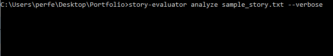

#Narrative AI CLI

A Python command line tool that analyzes storytelling structure, tone, humor, and creativity using AI.

Features
- Story structure detection
- Creativity scoring
- Humor and tone analysis
- CLI based workflow
- JSON output reports

Installation

pip install .

Usage

narrative-ai --text "Your story here" --full

AI Sample Output
---------------------------------------
File analyzed: script.txt

Story Structure
- Format detected: Linear narrative
- Story flow score: 8.4 / 10
- Pacing: Balanced

Tone Analysis
- Primary tone: Reflective
- Humor level: Low
- Emotional impact: Medium

Creativity Analysis
- Originality score: 7.9 / 10
- Predictability: Moderate
- Idea density: High

Writing Quality
- Dialogue strength: Strong
- Scene clarity: Clear
- Engagement potential: High

Overall Score: 8.1 / 10

Suggestions
- Increase tension in the second act
- Add a stronger hook in the opening scene
- Consider a twist or unexpected character decision

Note: The example output above demonstrates how the tool evaluates scripts.
Actual results require an API key configured locally.
No API keys are included in this repository.
